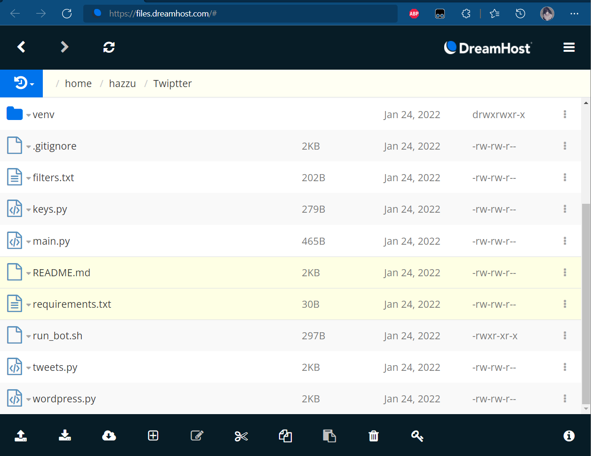
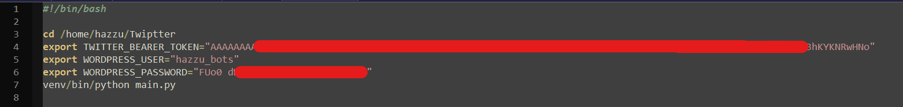
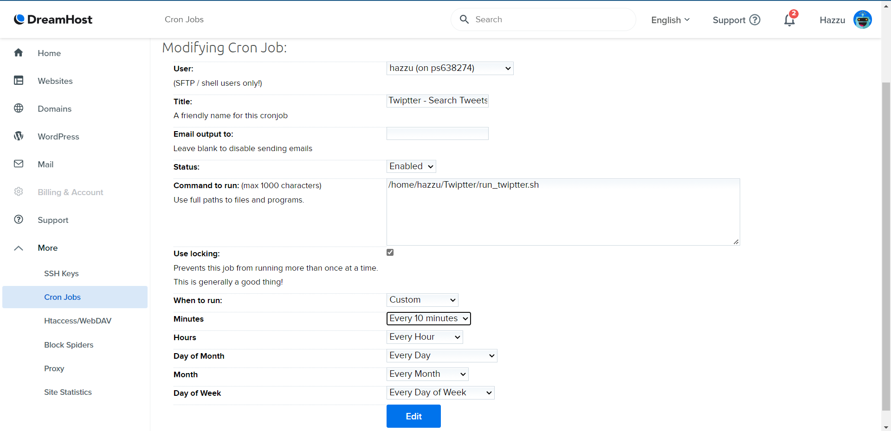
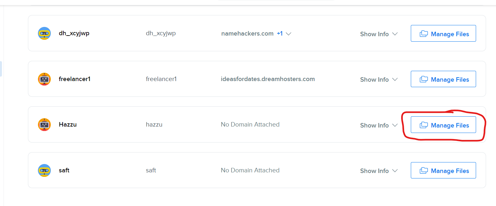
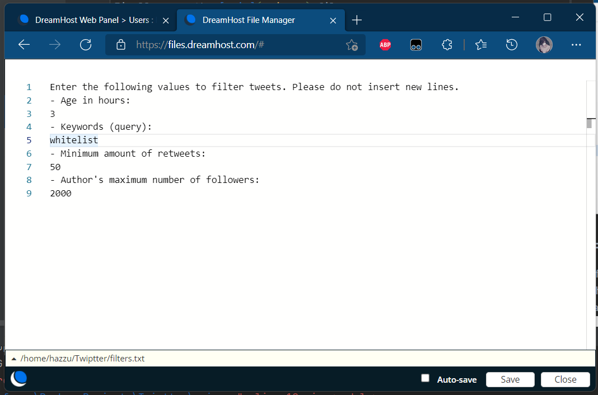
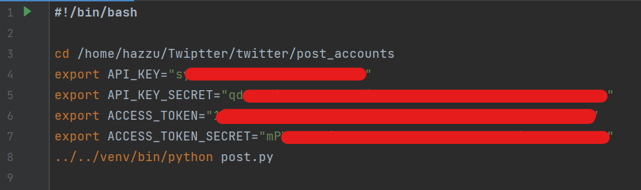

# Twiptter
This is a Twitter bot that collects tweets according to certain filters and publishes then in a WordPress site.
### How it works?
In the [main](main.py) file we create a script that that should run every 10 minutes. This script will search for matched tweets and publish them on the WordPress site.

The [twitter](twitter) module is responsible for connecting to the Twitter API and searching for tweets according to the filters specified in [filters](twitter/filters.txt).

The [wordpress](wordpress) module is responsible for publish the mateched tweets on the WordPress site. The bot will create a new post on the WordPress site to publicize the tweet, which contains a description (tweet text), author profile image and author username. If there is already a post for that user, the bot will simply add this new one to the end of the post. The bot will be able to find posts for a certain user by looking for its id, since when creating a post the bot intentionally adds a html comment containing the `author_id`.
### How to run the bot
First make sure you are using python 3.6 or higher. Then install the [requirements](requirements.txt) with `pip`.
You will need to set the environment variables (create an application password on WP for this):
```bash
export TWITTER_BEARER_TOKEN=""
export WORDPRESS_USER=""
export WORDPRESS_PASSWORD=""
```
Finally, run the [main](main.py) file:
```bash
python main.py
```
### Setting it on DreamHost
To run this bot on DreamHost (the platform used by the client) I deployed the application using SSH and Git and then configured the python environment on the machine. All files referring to the bot are located at the address `/home/hazzu/invit_catcher`.

To run it I created a bash script `run_bot.sh` where I set the environment variables and call [main](main.py). That way I can run the bot automatically from a Cron Job:



### Filtering tweets
If you want to edit the [filters](twitter/filters.txt) parameters, you can edit this file through the file manager. \
Go to *Manage Files* from *Hazzu* and edit the file `Twippter/filters.txt`:


 You can read [this guid](https://developer.twitter.com/en/docs/twitter-api/tweets/search/integrate/build-a-query) to learn how to build a query. After editing, save the file to apply the changes.

### Post accounts on Twitter
An additional module [post_accounts](twitter/post_accounts) was developed to post the found accounts on Twitter using a [template image](twitter/post_accounts/model_accounts_post.png).
The text to be published with the image can be changed in the file [post_message](twitter/post_accounts/post_message.txt). Always when executed, the script will load the last accounts published on Wordpress and post on Twitter. This module can be executed similarly to the main program file. For that, I created a bash script to run it from a cron job: 